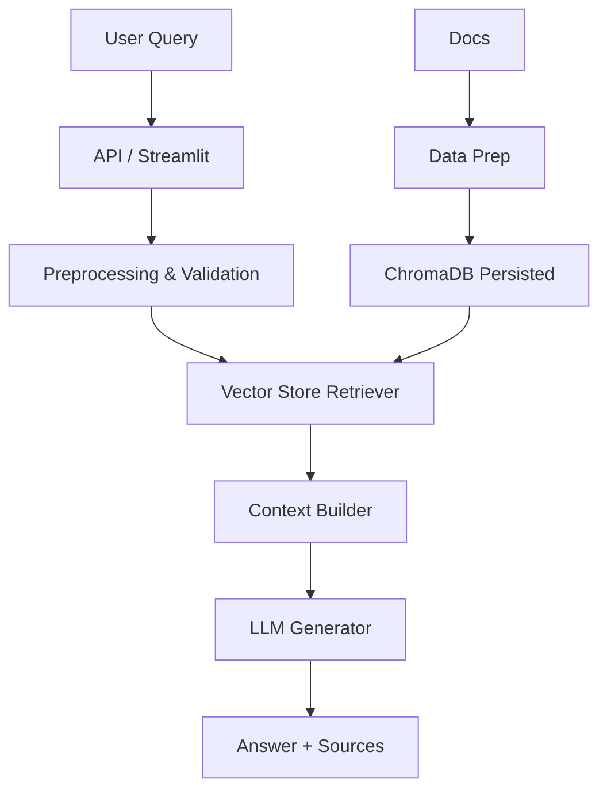

# 💬 Day 03 — RAG Chatbot API (LangChain + ChromaDB)


A production-ready Retrieval-Augmented Generation (RAG) chatbot that ingests documents, builds a vector store, and answers questions with citations. Supports OpenAI (when configured) and local embeddings fallback.

---

## ✨ Features

- **Document ingestion & vectorization** with ChromaDB
- **OpenAI or local embeddings** (auto fallback)
- **FastAPI** inference service
- **Streamlit** demo UI
- **Docker** multi-stage build
- **Comprehensive tests** (15+)

---

## 🧠 Architecture



---

## 📦 Project Structure

```
.
├── api
├── app
├── data
├── docker
├── inference
├── notebooks
├── tests
└── training
```

---

## ⚡ Quickstart

1) **Install dependencies**

```bash
pip install -r requirements.txt
```

2) **Prepare data & build vector store**

```bash
python data/prepare_data.py
python training/train.py
```

3) **Run the API**

```bash
uvicorn api.main:app --reload
```

4) **Launch Streamlit UI**

```bash
streamlit run app/streamlit_app.py
```

---

## 🔐 Environment Variables

- `OPENAI_API_KEY` — enables OpenAI Chat completion
- `EMBEDDING_PROVIDER` — `openai` or `local`
- `RAG_TOP_K` — number of retrieved docs
- `RAG_VECTOR_DB_DIR` — override vector store path

---

## 📡 API Endpoints

### `POST /chat`
**Request**
```json
{ "query": "What is this project about?", "top_k": 4 }
```

**Response**
```json
{ "answer": "...", "sources": [{"id": "doc-1", "score": 0.82}] }
```

### `POST /ingest`
Ingest custom documents (title + content) into the vector store.

### `GET /health`
Health check.

---

## 🐳 Docker

```bash
docker build -f docker/Dockerfile -t rag-chatbot:latest .
docker compose -f docker/docker-compose.yml up
```

---

## ✅ Tests

```bash
pytest -q
```

---

## 📄 License

MIT
